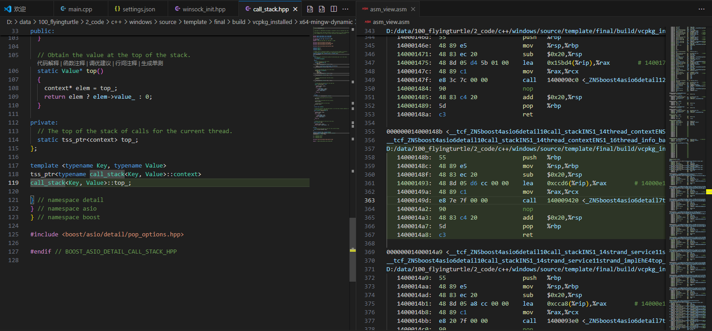

# Debug Info File Line Highlight Plugin

[中文版](README.md)

This plugin is a code editor extension specifically designed for developers to enhance their debugging experience through visualization. It intelligently parses the association between assembly instruction addresses and source code file line numbers from debug output, enabling bidirectional highlighting and navigation within your code editor. This helps you understand program execution flow more quickly and intuitively.

## Features

* **Intelligent Debug Info Parsing**: Automatically identifies and parses debug information from debugging tools (such as GDB, LLDB, etc.), extracting file paths, line numbers, and corresponding assembly instruction addresses.
* **Source Code Line Highlighting**: Based on the parsed debug information, it precisely highlights the source code line corresponding to the current debug point or selected assembly instruction in the code editor, providing instant visual feedback.
* **Bidirectional Assembly-Source Code Mapping**:
    * **From Assembly to Source Code**: When you select an assembly instruction in the debug view, the plugin will automatically jump to and highlight its corresponding line in the source code file.
    * **From Source Code to Assembly**: When you select a line of code in the source file, the plugin can display or navigate to its associated assembly instruction (if the debug information contains this mapping).

## Example

**Plugin Parsing and Visual Effect:**

The plugin will identify the file path `D:/data/100_flyingturtle/2_code/c++/windows/source/template/final/build/vcpkg_installed/x64-mingw-dynamic/include/boost/asio/execution_context.hpp` and line number `119`. It will associate this information with the assembly address `14000148b`.

When you click on the address `14000148b`, the plugin will automatically open or switch to the `execution_context.hpp` file in your code editor and highlight line `119`, as shown in the image below (example image, actual effect may vary depending on editor theme):

Conversely, if you click on line `119` in the source code, the plugin can jump to the corresponding assembly instruction in the debug output and highlight it.

## Installation and Usage

1.  **Installation**:
    * **Via VS Code Marketplace**: Open the Extensions view in VS Code (`Ctrl+Shift+X`), search for "jumptrace", and click "Install".
    * **Manual Installation (VSIX)**: If you have the plugin's `.vsix` file, you can install it in VS Code using the "Install from VSIX" option.
2.  **Configuration**:
    * Plugin behavior can be customized through VS Code's user or workspace settings. See the "Configuration Example" section below for details.
    * Ensure your project workspace is correctly loaded so the plugin can locate source code files.
3.  **Usage**:
    * Start your debugging session.
    * **Switch Mapping Mode**: Use the `jumptrace.switchover` command to switch between different mapping modes (one-way mapping, bidirectional mapping); file paths must be configured first.
    * **Close Mapping**: You can run the `jumptrace.close` command via the Command Palette (`Ctrl+Shift+P`).
    * When the debugger output contains debug information with file paths and line numbers, click on the line number, and the plugin will automatically highlight the corresponding source code line and assembly code in the code editor.
    * By making selections in the assembly view or source code view, the plugin will perform corresponding jump or highlight operations based on your mode configuration.

## Configuration Example

You can configure the behavior of the `jumptrace` plugin in VS Code's `settings.json` file. The following are available configuration items and their examples:

```json
{
    // Target file path, typically the debug output or a file containing mapping relationships
    // Supports the $workspaceFolder variable, e.g., "$workspaceFolder/build/debug_output.log"
    "jumptrace.file_path": "/path/to/your/debug_info_file.log",

    // Background color for highlighted lines, can use CSS color formats (e.g., rgba, #RRGGBB, etc.)
    "jumptrace.highlightBackgroundColor": "rgba(131, 247, 95, 0.3)",

    // Regular expression used to match debug output paths and line numbers
    // Customize this if your debug output format is specific.
    "jumptrace.pathRegex": "^([A-Za-z]:[\\\\/].*?):(\\d+)$",

    // Regular expression used to skip irrelevant lines in debug output
    // Lines matching this regex will not be processed by the plugin. By default, lines starting with whitespace are skipped.
    "jumptrace.skipRegex": "^\\s+",
}
```
## Contributing
We welcome contributions of all forms! If you have feature suggestions, found a bug, or wish to submit code, please visit our [GitHub repository address](https://github.com/flyingturtle543/vscode_jumptrace) and open an "Issue" or "Pull Request".

## License
This plugin is released under the [e.g., MIT License]. Please refer to the LICENSE file for details.